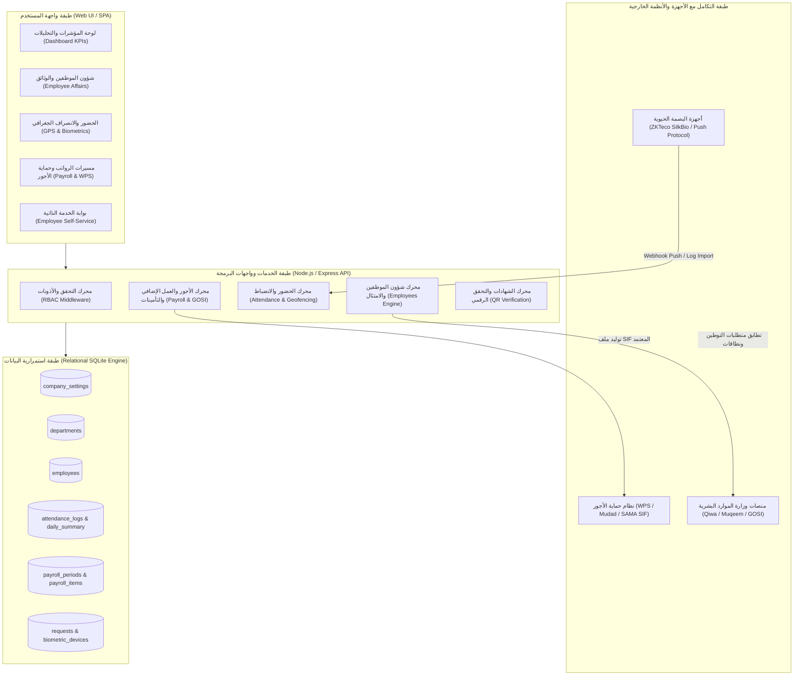
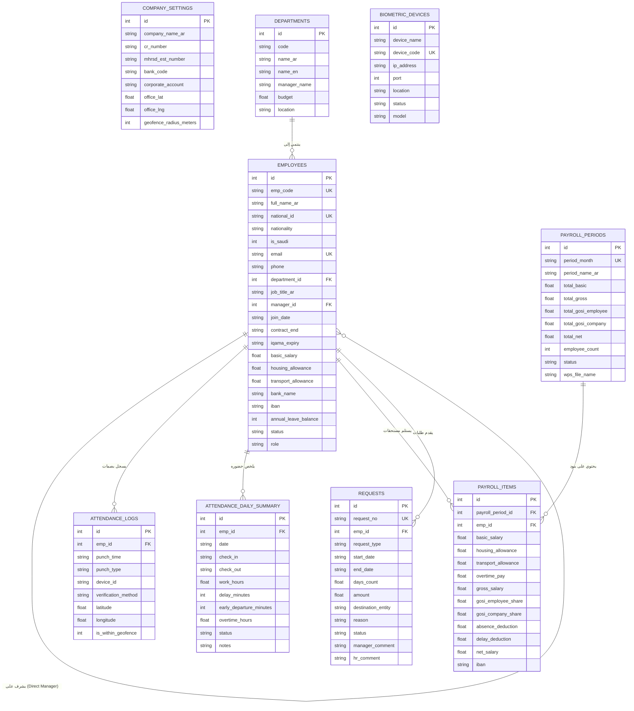

# وثيقة البنية المعمارية ومخطط الكيانات (System Architecture & ERD)
## نظام إدارة الموارد البشرية لشركة "جوهرة المجد" (Jawharat Al-Majd HRMS)

---

### 1. نظرة عامة ورؤية النظام المعمارية

تم تصميم وتطوير نظام الموارد البشرية لشركة **"جوهرة المجد للتجارة والخدمات"** وفق أحدث معايير هندسة البرمجيات لتلبية الاحتياجات التشغيلية للشركات المتوسطة والكبيرة في المملكة العربية السعودية، مع مراعاة المتطلبات التنظيمية الصارمة الصادرة عن **وزارة الموارد البشرية والتنمية الاجتماعية (MHRSD)**، و**المؤسسة العامة للتأمينات الاجتماعية (GOSI)**، و**البنك المركزي السعودي (SAMA)**، ونظام **حماية الأجور (WPS / منصة مدد)**.

تعتمد البنية الهندسية على معمارية الطبقات المتكاملة (Layered Enterprise Architecture):
1. **طبقة العرض والواجهة (Presentation Layer)**: واجهة مستخدم حديثة متجاوبة أحادية الصفحة (SPA)، ترتكز على هوية شركة جوهرة المجد الرسمية (ألوان الشعار: المارون الداكن `#700c14`، والذهبي الملكي `#d4af37`)، مع دعم مبدئي للغة العربية واتجاه RTL.
2. **طبقة منطق الأعمال والخدمات (Domain & Application Logic)**: وحدات وظيفية مستقلة (Modular Design) لإدارة شؤون الموظفين، محرك احتساب الرواتب والبدلات، محرك تدقيق التأمينات الاجتماعية (GOSI)، محرك الحضور والورديات، ومعالج طلبات الخدمة الذاتية.
3. **طبقة التكامل والأجهزة الخارجية (Integration & Hardware Adapters)**: محاكي ومستقبل بروتوكولات أجهزة البصمة الحيوية (ZKTeco ADMS / Push SDK)، ومولد ملفات حماية الأجور (WPS SIF Engine).
4. **طبقة تخزين واستمرارية البيانات (Data Persistence Layer)**: قاعدة بيانات علائقية SQLite فائقة السرعة والأمان، مدمجة بنواة Node.js v24 (`node:sqlite`)، ومفهرسة بالكامل لدعم المعاملات التنافسية وضمان موثوقية ACID.

---

### 2. مخطط تدفق البيانات والبنية التحتية (Mermaid Flowchart)

---

### 3. مخطط علاقات الكيانات (Entity-Relationship Diagram - ERD)

---

### 4. قاموس البيانات المرجعي (Data Dictionary)

#### 4.1 جدول الموظفين (`employees`)
| الحقل | النوع | القيود | الوصف الهندسي |
| :--- | :--- | :--- | :--- |
| `id` | INTEGER | PRIMARY KEY | المعرف الداخلي الفريد للموظف |
| `emp_code` | TEXT | UNIQUE, NOT NULL | كود الموظف النظامي في الشركة (مثال: JM-1001) |
| `full_name_ar` | TEXT | NOT NULL | الاسم الرباعي الرسمي باللغة العربية |
| `full_name_en` | TEXT | NOT NULL | الاسم الرسمي بالحروف اللاتينية |
| `national_id` | TEXT | UNIQUE, NOT NULL | رقم الهوية الوطنية (يبدأ بـ 1) أو الإقامة (يبدأ بـ 2) بطول 10 أرقام |
| `nationality` | TEXT | NOT NULL | جنسية الموظف (سعودي، مصري، أردني...) |
| `is_saudi` | INTEGER | DEFAULT 1 | تصنيف الجنسية لغايات احتساب نسب التوطين ونطاقات والتأمينات (1=سعودي، 0=غير سعودي) |
| `department_id` | INTEGER | FK -> departments(id) | الإدارة التابع لها الموظف في الهيكل التنظيمي |
| `basic_salary` | REAL | DEFAULT 0 | الراتب الأساسي الشهري بالريال السعودي |
| `housing_allowance`| REAL | DEFAULT 0 | بدل السكن الشهري (يدخل في وعاء التأمينات GOSI) |
| `transport_allowance`| REAL | DEFAULT 0 | بدل النقل الشهري |
| `other_allowance` | REAL | DEFAULT 0 | مجموع البدلات الثابتة الأخرى (طبيعة عمل، هاتف، إلخ) |
| `iban` | TEXT | NOT NULL | رقم الحساب الدولي (IBAN) يبدأ بـ SA ويتكون من 24 خانة للصرف البنكي وحماية الأجور |
| `contract_end` | TEXT | NULLABLE | تاريخ انتهاء عقد العمل الموثق عبر منصة قوى (YYYY-MM-DD) |
| `iqama_expiry` | TEXT | NULLABLE | تاريخ انتهاء رخصة الإقامة للموظف المقيم |
| `annual_leave_balance`| INTEGER| DEFAULT 30 | رصيد الإجازات السنوية المتاح للموظف بالأيام |
| `role` | TEXT | CHECK(role) | دور المستخدم وصلاحياته: `admin`, `manager`, `employee` |

#### 4.2 جدول ملخص الحضور والانصراف اليومي (`attendance_daily_summary`)
| الحقل | النوع | القيود | الوصف الهندسي |
| :--- | :--- | :--- | :--- |
| `id` | INTEGER | PRIMARY KEY | المعرف الفريد للسجل اليومي |
| `emp_id` | INTEGER | FK -> employees(id) | معرف الموظف |
| `date` | TEXT | NOT NULL | تاريخ يوم العمل (YYYY-MM-DD) |
| `check_in` | TEXT | NULLABLE | أول بصمة دخول مسجلة في اليوم |
| `check_out` | TEXT | NULLABLE | آخر بصمة خروج مسجلة في اليوم |
| `work_hours` | REAL | DEFAULT 0 | ساعات العمل الفعلية المنجزة |
| `delay_minutes` | INTEGER | DEFAULT 0 | دقائق التأخير المحتسبة بعد فترة السماح الرسمية (15 دقيقة) |
| `overtime_hours` | REAL | DEFAULT 0 | ساعات العمل الإضافي المنجزة بعد نهاية الدوام الرسمي (16:00) |
| `status` | TEXT | DEFAULT 'حاضر' | تصنيف الحضور: `حاضر`, `متأخر`, `غائب`, `إجازة اعتيادية`, `عطلة` |

#### 4.3 جدول بنود مسيرات الرواتب (`payroll_items`)
| الحقل | النوع | القيود | الوصف الهندسي |
| :--- | :--- | :--- | :--- |
| `id` | INTEGER | PRIMARY KEY | المعرف الفريد لبند المسير |
| `payroll_period_id`| INTEGER| FK -> payroll_periods | مسير الشهر التابع له |
| `emp_id` | INTEGER | FK -> employees(id) | الموظف المستحق |
| `basic_salary` | REAL | NOT NULL | الراتب الأساسي في هذا الشهر |
| `overtime_pay` | REAL | DEFAULT 0 | أجر العمل الإضافي وفق المادة 107 = (الأساسي / 240) × الساعات × 1.5 |
| `gross_salary` | REAL | NOT NULL | إجمالي الراتب المستحق قبل أي استقطاعات |
| `gosi_employee_share`| REAL | DEFAULT 0 | استقطاع الموظف لصالح التأمينات (9.75% للسعودي من الأساسي+السكن) |
| `gosi_company_share` | REAL | DEFAULT 0 | مساهمة صاحب العمل في التأمينات (11.75% للسعودي، 2% أخطار للمقيم) |
| `absence_deduction` | REAL | DEFAULT 0 | خصومات الغياب = (الراتب الإجمالي / 30) × أيام الغياب |
| `net_salary` | REAL | NOT NULL | صافي الراتب النهائي القابل للتحويل البنكي |

---

### 5. محددات الأمان ومبادئ حماية البيانات (PDPL Compliance)

1. **التحكم بالوصول القائم على الأدوار (Role-Based Access Control - RBAC)**:
   - **مدير الموارد البشرية (Admin)**: صلاحيات كاملة لقراءة وتعديل وحذف الموظفين، اعتماد مسيرات الرواتب، توليد ملفات حماية الأجور، وإدارة تهيئة النظام.
   - **مدير الإدارة (Department Manager)**: استعراض موظفي قسمه فقط، متابعة حضور فريقه، والموافقة المبدئية على طلبات الإجازات والاستئذانات.
   - **الموظف (Employee)**: صلاحية محصورة على ملفه الشخصي، تسجيل حضوره الجغرافي، تقديم الطلبات، ومتابعة قسائم راتبه وتحميل خطابات التعريف الخاصة به فقط.
2. **الامتثال لنظام حماية البيانات الشخصية السعودي (PDPL)**:
   - عزل الأرقام البنكية والهويات الوطنية، وتوليد ملفات حماية الأجور بالصيغة القياسية المعتمدة من ساما (SAMA SIF).
   - منع تضمين أي بيانات حساسة غير ضرورية في الباركود التعريفي، واعتماد التجزئة والتشفير في بيانات التحقق.
